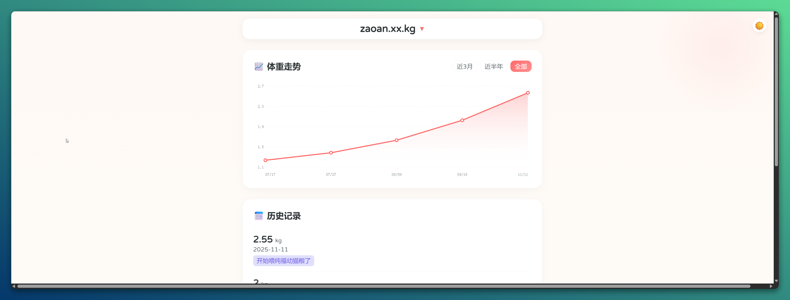
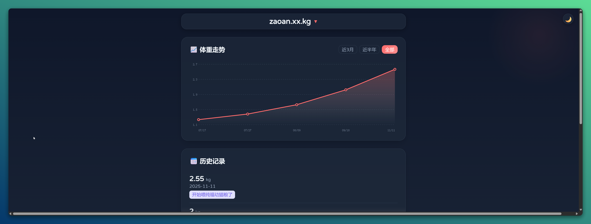

# 🐱 Purrfit | 猫咪体重记录

**[English](#english) | [中文说明](#中文说明)**

---

## 📸 Screenshots

| Light Mode | Dark Mode | Mobile PWA |
| :---: | :---: | :---: |
|  |  |  |

---

## 🇬🇧 English

**Purrfit** is the ultimate serverless Cat Weight Tracker built on **Cloudflare Workers**. It combines a beautiful glassmorphism UI with powerful data management features, running entirely for free on your own Cloudflare account.

> 💡 **Name Origin**: A blend of **Purr** (the sound of a happy cat) + **Fit** (health/fitness). It sounds like *"Perfect"*.

## 🎮 Live Demo

Try it out immediately without deployment:

🌐 **URL**: [https://zao.qzz.io](https://zao.qzz.io)

| Role | Username | Password | Notes |
| :--- | :--- | :--- | :--- |
| **Demo User** | `test` | `123456` | Data auto-wipes every 30 mins |

> **Note**: In Demo mode, sensitive actions (Settings, Import/Export) are **read-only** to prevent abuse.

### ✨ Ultimate Features

* **☁️ Serverless & Free**: Hosted on Cloudflare Workers + KV. No server maintenance, zero cost for personal use.
* **🎨 Modern UI**: Glassmorphism design, 3D tilt cards, light/dark mode with dynamic spotlight effects, and smooth animations.
* **⚙️ Dynamic Configuration**: Manage site title, favicon, and cat list directly from the **Settings Dashboard**. No need to redeploy code!
* **🐱 Smart Cat Management**:
    * **Add/Remove Cats**: Easily manage multiple pets.
    * **Rename & Migrate**: Renaming a cat automatically **migrates all historical data** to the new name. No data loss.
* **📊 Visualization**: Interactive charts with time filters (3M/6M/All) and smart tooltips that never get clipped.
* **📂 Data Freedom**: Full CSV Import/Export support with intelligent deduplication.
* **📱 PWA Ready**: Install as a native-like app on iOS/Android. Optimized touch interactions and layouts.
* **🌍 i18n**: Instant switching between English and Chinese.

### 🚀 Deployment Guide

#### 1. Create KV Namespace
1.  Log in to [Cloudflare Dashboard](https://dash.cloudflare.com/).
2.  Sidebar: **Storage & Databases** -> **Workers KV**.
3.  Create a namespace named `CAT_WEIGHT_KV` (or any name).

#### 2. Create Worker
1.  Sidebar: **Compute (Workers & Pages)** -> **Overview**.
2.  **Create Application** -> **Create Worker**.
3.  Name it `purrfit` and **Deploy**.

#### 3. Configure Bindings & Variables (Crucial!)

**A. Bind KV Namespace (In "Bindings" Tab):**
1.  Go to your Worker's dashboard.
2.  Click the **Bindings** tab in the top menu bar.
3.  Scroll to **KV Namespace Bindings** and click **Add** (or **Connect**).
    * **Variable name**: `CAT_KV` (**Must be exactly this**).
    * **Namespace**: Select the namespace created in Step 1.
4.  Click **Deploy** to save.

**B. Environment Variables (In "Settings" Tab):**
1.  Click the **Settings** tab in the top menu bar -> Select **Variables**.
2.  Scroll to **Environment Variables** and click **Add variable**.
3.  Add the following variables:
    * `ADMIN_USER`: Your desired username (e.g., `admin`).
    * `ADMIN_PASS`: Your desired password.
    * *(Optional)* `CAT_NAMES`: Initial cat names (e.g., `Luna,Oreo`). *Note: You can manage cats in the UI later.*
4.  Click **Deploy** to save.

#### 4. Upload Code
1.  Click the **Edit code** button (top right).
2.  Copy the content of `worker.js` from this repository.
3.  Paste it into the editor and **Deploy**.

🎉 **Enjoy!** Visit your URL to start tracking.

### 📱 Mobile Usage (PWA)
1.  Open the website in Safari (iOS) or Chrome (Android).
2.  Tap the **Share** button (iOS) or **Menu** (Android).
3.  Select **Add to Home Screen**.
4.  Launch Purrfit from your home screen for a full-screen app experience.

### 🛠️ FAQ

**Q: How to change the site title or favicon?**
A: Login and click the **"⚙️ Settings"** button. You can update global configs there without touching the code.

**Q: Will renaming a cat lose data?**
A: No. Use the **✎ (Edit)** button in the Settings panel to rename. The system will automatically migrate all historical records to the new name.

> 🤖 **Customization Tip**: If you have other requirements, feel free to send this project URL or source code to AI models like **Google Gemini** to generate customized code for you!

---

## 🇨🇳 中文说明

**Purrfit** 是一个基于 **Cloudflare Workers** 构建的终极形态猫咪体重记录本。它将唯美的磨砂玻璃界面与强大的数据管理功能完美融合，完全免费托管。

> 💡 **名字由来**：由 **Purr** (猫咪呼噜声) + **Fit** (健康身材) 组合而成。读音谐音 *"Perfect"* (完美)。

## 🎮 在线体验

无需部署，直接点击下方链接体验：

🌐 **URL**: [https://zao.qzz.io](https://zao.qzz.io)

| 测试用户 | 测试密码 | 提醒 |
| :--- | :--- | :--- |
| `test` | `123456` |  (数据每30分钟自动清除) |

> **提示**：演示模式下，为了防止滥用，全局设置和导入导出功能为**只读**状态。

### ✨ 核心特性

* **☁️ 无服务器架构**：完全运行在 Cloudflare Workers + KV 上，零维护，个人使用完全免费。
* **🎨 极致 UI 设计**：磨砂玻璃质感、卡片 3D 悬浮、光影跟随效果（深色/浅色模式适配）、丝滑动画。
* **⚙️ 全动态配置**：通过网页端的 **“设置”** 面板即可修改网站标题、图标和猫咪列表，**无需修改代码或重新部署**。
* **🐱 智能猫咪管理**：
    * **增删管理**：随时添加或移除猫咪标签。
    * **重命名与迁移**：修改猫咪名字时，系统会自动将**所有历史权重数据迁移**到新名字下，确保数据连续性。
* **📊 数据可视化**：原生 SVG 绘制的平滑曲线图，支持时间筛选，气泡提示智能防遮挡。
* **📂 数据自由**：支持 CSV 批量导入与导出，内置智能去重逻辑。
* **📱 完美 PWA 体验**：支持“添加到主屏幕”，在手机上拥有原生 App 般的沉浸式体验。
* **🌍 双语支持**：中英文一键无缝切换。

### 🚀 部署指南

#### 1. 创建 KV 数据库
1.  登录 [Cloudflare 控制台](https://dash.cloudflare.com/)。
2.  左侧菜单：**存储和数据库 (Storage & Databases)** -> **Workers KV**。
3.  点击 **创建命名空间**，命名为 `CAT_WEIGHT_KV`（名字随意），点击添加。

#### 2. 创建 Worker
1.  左侧菜单：**计算 (Workers & Pages)** -> **概述**。
2.  点击 **创建应用程序** -> **创建 Worker**。
3.  起个名字（例如 `purrfit`），点击 **部署**。

#### 3. 配置绑定与变量（关键步骤！）

**A. 绑定 KV 数据库 (在 "绑定" 标签页):**
1.  进入你的 Worker 详情页。
2.  点击顶部菜单栏的 **绑定 (Bindings)** 标签。
3.  向下滑动找到 **KV 命名空间绑定**，点击 **添加 (Add)** 或 **连接 (Connect)**。
    * **变量名称**: 填写 `CAT_KV` (**必须完全一致，不能改**)。
    * **KV 命名空间**: 选择第 1 步创建的数据库。
4.  点击 **部署 (Deploy)** 保存。

**B. 添加环境变量 (在 "设置" 标签页):**
1.  点击顶部菜单栏的 **设置 (Settings)** -> 选择左侧的 **变量 (Variables)**。
2.  找到 **环境变量** 区域，点击 **添加变量**。
3.  添加以下变量：
    * `ADMIN_USER`: 设置你的后台登录用户名。
    * `ADMIN_PASS`: 设置你的后台登录密码。
    * *(可选)* `CAT_NAMES`: 初始猫咪名字（例如 `汤圆,麻薯`）。*注：部署后可在网页设置中直接修改。*
4.  点击 **部署 (Deploy)** 保存。

#### 4. 部署代码
1.  点击右上角的 **编辑代码 (Edit code)**。
2.  复制本项目 `worker.js` 的全部代码。
3.  粘贴到编辑器中覆盖原始内容，点击 **部署 (Deploy)**。

🎉 **大功告成！** 访问你的域名即可开始使用。

### 📱 手机端使用技巧 (PWA)
1.  在手机 Safari (iOS) 或 Chrome (Android) 中打开网站。
2.  点击 **分享** 按钮 -> 选择 **添加到主屏幕**。
3.  桌面会出现 **Purrfit** 图标，点击即可享受全屏 App 体验。

### 🛠️ 常见问题

**Q: 如何修改网站标题或图标？**
A: 登录后，点击输入框上方的 **“⚙️ 网站设置”** 按钮，即可在弹窗中修改全局配置，无需触碰代码。

**Q: 改名后数据会丢吗？**
A: 不会。请在设置中点击猫咪标签上的 **✎ (编辑)** 按钮进行改名，系统会自动迁移该猫咪名下的所有历史数据。

> 🤖 **定制提示**: 如果您有其他个性化需求，可以把本项目地址或源码发送给 **Google Gemini** 等 AI 大模型，让它们帮您生成新的代码！

---

## 📄 License

[MIT License](LICENSE) © 2025
